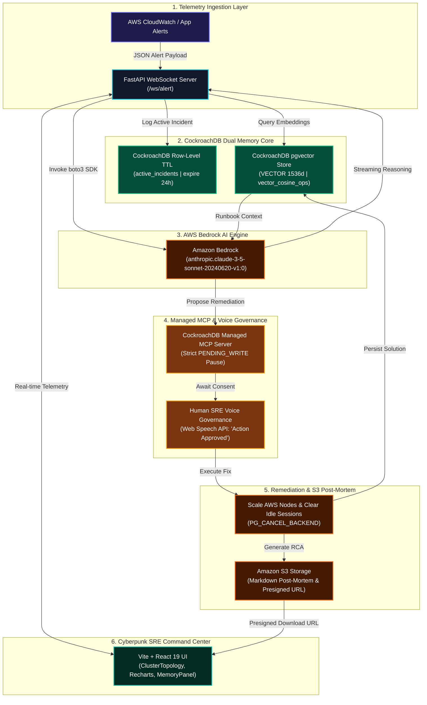

# 📐 SentinelAgent System Architecture Specification

> **System**: SentinelAgent — Autonomous Level 3 SRE AI System  
> **Hackathon**: CockroachDB × AWS Hackathon  
> **Authors**: Saaketh Kazipeta & Lalitha Subramanyam  

---

## 📌 1. System Overview

**SentinelAgent** is an autonomous Site Reliability Engineering (SRE) incident detection, diagnostic, and self-healing system designed to resolve cloud infrastructure outages in real-time.

The system combines **CockroachDB Serverless** dual memory storage (Row-Level TTL & pgvector 1536d cosine similarity search), **Amazon Bedrock** (Anthropic Claude 3.5 Sonnet), the **CockroachDB Managed Model Context Protocol (MCP)** server, and a **Vite/React glassmorphic command center**.

---

## 📊 2. High-Level System Architecture Diagram (Mermaid.js)



---

## 🏗️ 3. C4 Container Architecture Diagram (PlantUML)

```plantuml
@startuml SentinelAgent_C4_Architecture
!include https://raw.githubusercontent.com/plantuml-stdlib/C4-PlantUML/master/C4_Container.puml

TITLE SentinelAgent - Autonomous Level 3 SRE System Architecture

Person(sre, "Human SRE Engineer", "Governs automated actions via Voice API and Cyberpunk Command Center")

System_Boundary(sentinel_system, "SentinelAgent Ecosystem") {
    Container(ui, "Vite React SRE Dashboard", "React 19, Tailwind CSS", "Renders 144 FPS thought streams, ClusterTopology, and voice controls")
    Container(backend, "FastAPI Async Engine", "Python 3.11, WebSockets", "Orchestrates streaming telemetry, pgvector search, and Bedrock calls")
    ContainerDb(cockroach_db, "CockroachDB Dual Memory", "CockroachDB Serverless", "Stores Row-Level TTL active incidents (24h) and 1536d vector runbook embeddings")
    Container(mcp_server, "Managed MCP Governance Server", "Model Context Protocol", "Enforces strict PENDING_WRITE execution pause state prior to execution")
    Container(bedrock, "Amazon Bedrock AI Core", "boto3 / Claude 3.5 Sonnet", "Synthesizes observations, vector memory matches, and remediation actions")
    Container(s3, "Amazon S3 Storage Vault", "AWS S3", "Archives Markdown post-mortems and serves 1-hour presigned download URLs")
}

Rel(sre, ui, "Approves remediation via Voice ('Action Approved')", "Web Speech API")
Rel(ui, backend, "Streams telemetry & receives audit events", "WebSocket /ws/alert")
Rel(backend, cockroach_db, "Executes vector_cosine_ops similarity search", "psycopg2 pool")
Rel(backend, bedrock, "Streams reasoning tokens", "boto3 Bedrock Runtime")
Rel(backend, mcp_server, "Enforces PENDING_WRITE pause gate", "MCP JSON-RPC")
Rel(backend, s3, "Uploads post-mortem & gets presigned URL", "boto3 S3")
Rel(mcp_server, cockroach_db, "Terminates idle sessions upon voice approval", "PG_CANCEL_BACKEND")

@enduml
```

---

## 🔄 4. Detailed Component Data Flow Specifications

### 1. Telemetry Ingestion Layer
- **Protocol**: Asynchronous WebSockets (`/ws/alert`) over FastAPI.
- **Payload Handling**: Ingests JSON alert payloads containing service labels, error codes, and telemetry metrics (e.g. `DB Connection Pool Exhausted`).

### 2. CockroachDB Dual Memory Core
- **Ephemeral Storage**: Logs incoming incidents into `active_incidents` table configured with Row-Level TTL: `WITH (ttl_expire_after = '24 hours')`.
- **Vector Memory**: Performs 1536-dimensional vector similarity search against historical incident runbooks in `incident_memory` using pgvector HNSW index: `CREATE INDEX ... USING hnsw (embedding vector_cosine_ops);`.

### 3. Amazon Bedrock AI Reasoning Engine
- **SDK**: `boto3.client('bedrock-runtime')`.
- **Model**: `anthropic.claude-3-5-sonnet-20240620-v1:0`.
- **Reasoning Loop**: Sequential 3-phase thought process (`RECEIVE_TELEMETRY` $\rightarrow$ `VECTOR_SEARCH` $\rightarrow$ `DIAGNOSE` / `PROPOSE_FIX`).

### 4. Managed MCP & Voice Governance Gate
- **State Enforcement**: Managed MCP server halts destructive actions by transitioning to a strict `PENDING_WRITE` execution pause state.
- **Voice Consent**: Accepts human voice authorization via Web Speech API (`"Action Approved"`) or manual SRE click to unblock remediation.

### 5. Automated Remediation & S3 Archival
- **Cluster Fix**: Cancels stale idle connections (`PG_CANCEL_BACKEND`) and scales AWS EC2 cluster nodes.
- **S3 Archival**: Prompts Claude 3.5 Sonnet to format an Incident Post-Mortem, uploads to S3 bucket (`sentinel-agent-postmortems`), and generates a 1-hour presigned URL.
- **Memory Upsert**: Writes the verified resolution embedding back into CockroachDB `incident_memory` for future zero-shot vector recall.

---

## 🧰 5. Technology Stack Matrix

| Component Layer | Primary Technology | Configuration / Schema Specification |
| --- | --- | --- |
| **Distributed Database** | CockroachDB Serverless | `VECTOR(1536)`, `vector_cosine_ops`, `ttl_expire_after = '24 hours'` |
| **AI LLM Engine** | Amazon Bedrock | `anthropic.claude-3-5-sonnet-20240620-v1:0` via `boto3` |
| **DB Protocol Governance** | Managed MCP Server | Enforces `PENDING_WRITE` state pause prior to execution |
| **Post-Mortem Archival** | Amazon S3 | Markdown storage with `generate_presigned_url(ExpiresIn=3600)` |
| **Backend Framework** | FastAPI & WebSockets | Asynchronous Python 3.11 streaming backend |
| **SRE Command Center** | React 19, Vite, Tailwind | Glassmorphic dark UI, 144 FPS telemetry, ClusterTopology node visualizer |
