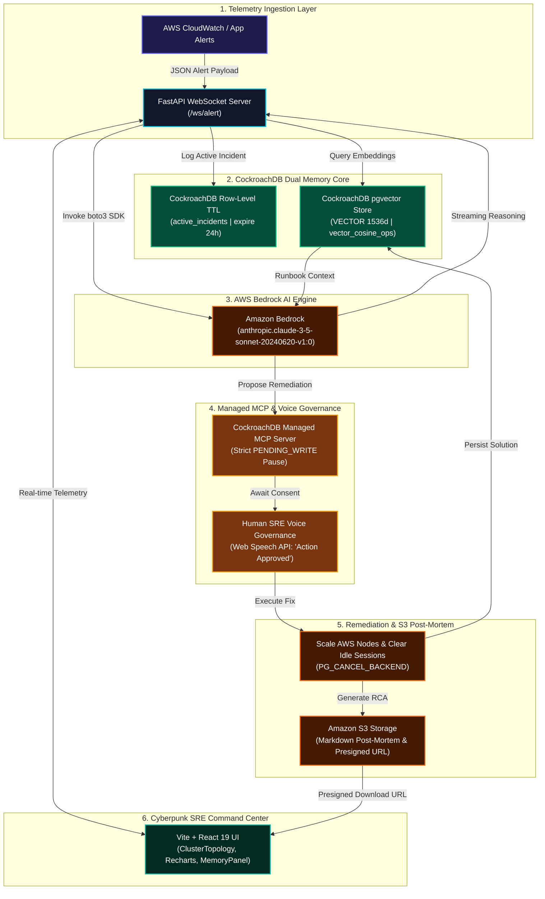

# 📐 SentinelAgent Architecture Diagram Prompts & Specifications

> **System**: SentinelAgent — Autonomous Level 3 SRE AI System  
> **Built For**: CockroachDB × AWS Hackathon  
> **Authors**: Saaketh Kazipeta & Lalitha Subramanyam  

---

## 🎨 1. AI Image Generator Prompt (Midjourney v6 / DALL-E 3 / Flux.1 / Imagen 3)

Copy and paste the following prompt into your preferred AI image generator (e.g. Midjourney, DALL-E 3, or Leonardo.ai) to produce a stunning 3D isometric cloud architecture diagram for SentinelAgent:

```text
A sleek 3D isometric enterprise cloud architecture diagram of an autonomous AI Site Reliability Engineering system named "SentinelAgent". 

Dark cyberpunk aesthetic with deep navy blue (#030712) background and luminous glowing neon lines. High-tech futuristic infrastructure visualization featuring distinct glassmorphic node blocks connected by glowing data conduits in cyan (#06b6d4), emerald green (#10b981), and warning amber (#f59e0b).

Key architectural nodes shown in the 3D isometric layout:
1. "AWS CloudWatch Telemetry Bus" emitting pulsing amber alert packets into a glowing FastAPI WebSocket gateway node.
2. "CockroachDB Dual Memory Core" at the center: a futuristic glowing server cluster split into two layers:
   - "Row-Level TTL Engine" (active incidents, expiring in 24 hours).
   - "1536d Vector Memory Index" (CockroachDB pgvector HNSW vector_cosine_ops index).
3. "Amazon Bedrock AI Engine" represented by a glowing purple-cyan neural core labeled "Anthropic Claude 3.5 Sonnet".
4. "Managed MCP Governance Node" acting as a security gate showing a bright amber shield icon with a "PENDING_WRITE Execution Pause" banner.
5. "Human SRE Voice Governance Bridge" depicting a glowing microphone icon connected to a voice approval gate ("Action Approved").
6. "Amazon S3 Storage Vault" displaying post-mortem markdown documents with a presigned URL key badge.
7. "Vite React Command Center" displaying a sleek 144 FPS glassmorphic cyberpunk SRE dashboard layout with Raft cluster topology mesh and real-time telemetry graphs.

Professional schematic layout, clean dark UI presentation, octane render style, isometric perspective, 8k resolution, crisp typography, clean isometric grid lines, visual tech stack logos, dark mode UI backdrop --ar 16:9 --style raw --v 6.0
```

---

## 📊 2. GitHub-Flavored Mermaid.js Architecture Diagram Code

Copy and paste the following Mermaid code block into any Markdown viewer, GitHub README, or Draw.io to render an interactive vector architecture diagram:



---

## 🏗️ 3. PlantUML / C4 Container Diagram Prompt

For enterprise architecture documentation tools (e.g., PlantUML, Structurizr, Lucidchart), use the C4 Model specification below:

```plantuml
@startuml SentinelAgent_C4_Architecture
!include https://raw.githubusercontent.com/plantuml-stdlib/C4-PlantUML/master/C4_Container.puml

TITLE SentinelAgent - Autonomous Level 3 SRE System Architecture

Person(sre, "Human SRE Engineer", "Governs automated actions via Voice API and Cyberpunk Command Center")

System_Boundary(sentinel_system, "SentinelAgent Ecosystem") {
    Container(ui, "Vite React SRE Dashboard", "React 19, Tailwind CSS", "Renders 144 FPS thought streams, ClusterTopology, and voice controls")
    Container(backend, "FastAPI Async Engine", "Python 3.11, WebSockets", "Orchestrates streaming telemetry, pgvector search, and Bedrock calls")
    ContainerDb(cockroach_db, "CockroachDB Dual Memory", "CockroachDB Serverless", "Stores Row-Level TTL active incidents (24h) and 1536d vector runbook embeddings")
    Container(mcp_server, "Managed MCP Governance Server", "Model Context Protocol", "Enforces strict PENDING_WRITE execution pause state prior to execution")
    Container(bedrock, "Amazon Bedrock AI Core", "boto3 / Claude 3.5 Sonnet", "Synthesizes observations, vector memory matches, and remediation actions")
    Container(s3, "Amazon S3 Storage Vault", "AWS S3", "Archives Markdown post-mortems and serves 1-hour presigned download URLs")
}

Rel(sre, ui, "Approves remediation via Voice ('Action Approved')", "Web Speech API")
Rel(ui, backend, "Streams telemetry & receives audit events", "WebSocket /ws/alert")
Rel(backend, cockroach_db, "Executes vector_cosine_ops similarity search", "psycopg2 pool")
Rel(backend, bedrock, "Streams reasoning tokens", "boto3 Bedrock Runtime")
Rel(backend, mcp_server, "Enforces PENDING_WRITE pause gate", "MCP JSON-RPC")
Rel(backend, s3, "Uploads post-mortem & gets presigned URL", "boto3 S3")
Rel(mcp_server, cockroach_db, "Terminates idle sessions upon voice approval", "PG_CANCEL_BACKEND")

@enduml
```

---

## 📝 4. Draw.io / Excalidraw Prompt & Structure Checklist

If building a diagram manually in **Draw.io**, **Excalidraw**, or **Figma**:

- [x] **Grid Alignment**: 3-column layout (Left: Ingestion & Telemetry, Middle: CockroachDB Dual Memory & AWS Bedrock, Right: Managed MCP Governance & React Dashboard).
- [x] **Color Tokens**:
  - **Background**: `#030712` (Slate 950 Dark)
  - **Database & Vectors**: `#06b6d4` (Cyan) & `#10b981` (Emerald)
  - **AI Reasoning**: `#8b5cf6` (Purple) & `#ec4899` (Pink)
  - **MCP Security Gate**: `#f59e0b` (Amber Glowing Shield)
  - **Remediation & S3**: `#f97316` (Orange)
- [x] **Data Flow Connectors**:
  - Solid arrows for synchronous DB reads & WebSocket events.
  - Dashed arrows for async S3 presigned URL downloads and post-mortem persistence.
  - Flashing Amber gate for `PENDING_WRITE` governance pauses.
