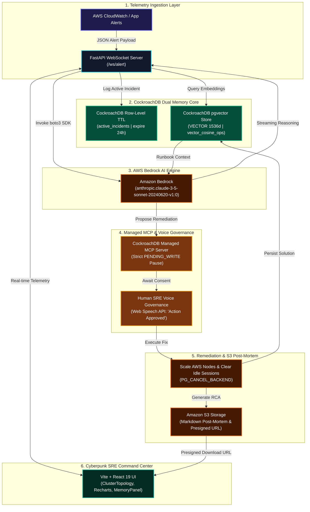

# ⚡ SentinelAgent

> **Autonomous Cloud Infrastructure & SRE Incident Responder**  
> *Built for the **CockroachDB × AWS Hackathon** by **Saaketh Kazipeta***

---

## 📌 Executive Summary

**SentinelAgent** is a Level-3 Autonomous Site Reliability Engineering (SRE) agent designed to diagnose, mitigate, and self-heal cloud infrastructure outages in real-time.

When production databases or microservices fail, traditional monitoring tools flood human engineers with noise. SentinelAgent acts as an always-on first responder: it ingests telemetry alerts, queries years of historical incident runbooks using **CockroachDB Distributed Vector Search**, executes live database health inspections via the **CockroachDB Managed MCP Server**, and executes safe remediations under **Human-in-the-Loop voice authorization**.

Once resolved, SentinelAgent automatically writes new post-mortem embeddings back into CockroachDB, expanding its persistent long-term memory so it never forgets a fix.

---

## 🎯 Key Features

* **🧠 Zero-Amnesia Memory Layer:** Uses CockroachDB `pgvector` index to recall historical incidents across server restarts, container failures, or database crashes.
* **🔍 Live State Inspection:** Connects directly via the CockroachDB Managed Model Context Protocol (MCP) server to query active connection pools, slow transactions, and node health.
* **🎙️ AI Voice & Human-in-the-Loop Control:** Requires explicit human authorization before executing scaling or destructive actions—supporting both click and Web Speech API voice commands ("*Action Approved*").
* **💻 Glassmorphic Cyberpunk Command Center:** A real-time dashboard featuring 144 FPS streaming terminal logs, live cluster telemetry charts (Recharts), and interactive 2D node graphs visualizing vector similarity search scores (`@xyflow/react`).
* **📱 Mobile Responsive & Hardware Accelerated:** Fully responsive UI with 144 FPS camera-gliding smooth scroll tracking and RAF typewriter streaming.
* **🌐 Netlify Deployment Ready:** Built-in `netlify.toml` and SPA `_redirects` for instant zero-configuration deployment.

---

## 🏗️ System Architecture



> 📖 **Full AI Architecture Diagram Prompts**: View [ARCHITECTURE_PROMPT.md](./ARCHITECTURE_PROMPT.md) for Midjourney v6, DALL-E 3, PlantUML, and Draw.io visual diagram specifications.

---

## 🧰 Technical Stack & Integration Matrix

| Component | Technology | Purpose |
| --- | --- | --- |
| **Database & Memory** | **CockroachDB Serverless** | Distributed SQL database with vector search (`pgvector`) & row-level TTL. |
| **DB Protocol Tool** | **CockroachDB Managed MCP Server** | Model Context Protocol server for inspecting transactional state and locks. |
| **Cluster CLI** | **CockroachDB `ccloud` CLI** | Automates node scaling and resource configuration during incidents. |
| **Reasoning Engine** | **Amazon Bedrock** | Anthropic Claude 3.5 Sonnet model hosted on AWS infrastructure. |
| **Backend Service** | **FastAPI & WebSockets** | Python 3.11 asynchronous streaming server. |
| **Frontend UI** | **React 19, Vite, Tailwind CSS, Framer Motion** | Glassmorphic dark-mode SRE terminal with Web Speech API support. |
| **Hosting & CI/CD** | **Netlify** | Zero-config continuous deployment with `netlify.toml`. |

---

## 🌐 Netlify Deployment Guide

SentinelAgent includes pre-configured `netlify.toml` and SPA `_redirects` rules for one-click deployment.

### Option A: Import GitHub Repository in Netlify (Recommended)

1. Log into your **[Netlify Dashboard](https://app.netlify.com)**.
2. Click **"Add new site"** $\rightarrow$ **"Import an existing project"**.
3. Select **GitHub** and authorize your account.
4. Pick repository: `SAAKETH12345/sentinel-agent`.
5. Netlify will auto-detect the configuration from `netlify.toml`:
   - **Base directory:** `sentinel-agent-main`
   - **Build command:** `npm run build`
   - **Publish directory:** `sentinel-agent-main/dist`
6. Click **"Deploy sentinel-agent"**!

---

### Option B: Deploy via Netlify CLI

```bash
# Install Netlify CLI globally
npm install -g netlify-cli

# Navigate to project directory
cd sentinel-agent-main

# Authenticate with Netlify
netlify login

# Deploy preview or production site
netlify deploy --build --prod
```

---

## 🗄️ Database Schema Setup

Execute the following SQL statements in your CockroachDB Cloud SQL console:

```sql
-- Create table for persistent incident memory
CREATE TABLE incident_memory (
    id UUID PRIMARY KEY DEFAULT gen_random_uuid(),
    service_name STRING NOT NULL,
    error_log TEXT NOT NULL,
    root_cause TEXT NOT NULL,
    resolution_steps TEXT NOT NULL,
    embedding VECTOR(1536), -- Dimension for Titan/Claude vector embeddings
    created_at TIMESTAMPTZ DEFAULT now()
);

-- Create inverted index for high-speed vector similarity search
CREATE INVERTED INDEX ON incident_memory (embedding vector_cosine_ops);
```

---

## ⚙️ Environment Variables Setup

Create a `.env` file in `backend/.env`:

```env
# CockroachDB Configuration
DATABASE_URL="postgresql://saaketh:<YOUR_PASSWORD>@sentinel-agent-db-29931.j77.aws-ap-south-1.cockroachlabs.cloud:26257/defaultdb?sslmode=verify-full"
COCKROACH_MCP_ENDPOINT="https://mcp.cockroachlabs.cloud/v1/query"

# AWS Configuration
AWS_REGION="us-east-1"
AWS_ACCESS_KEY_ID="your_aws_access_key"
AWS_SECRET_ACCESS_KEY="your_aws_secret_key"
BEDROCK_MODEL_ID="anthropic.claude-3-5-sonnet-20240620-v1:0"

# Application Settings
PORT=8000
HOST="0.0.0.0"
```

---

## 🛠️ Build & Installation Commands

### 1. Prerequisites

* **Python:** `3.11` or higher
* **Node.js:** `v18.0.0` or higher
* **CockroachDB Certificate:** Ensure `root.crt` is installed locally in `%APPDATA%\postgresql\root.crt` (Windows) or `~/.postgresql/root.crt` (Linux/macOS).

---

### 2. Backend Setup (FastAPI & Agent Engine)

```bash
# Clone the repository
git clone https://github.com/SAAKETH12345/sentinel-agent.git
cd sentinel-agent/sentinel-agent-main/backend

# Create and activate Python virtual environment
python -m venv venv
source venv/bin/activate  # On Windows: venv\Scripts\activate

# Install dependencies
pip install -r requirements.txt

# Start the FastAPI server
python main.py
```

---

### 3. Frontend Setup (React Vite SRE Command Center)

```bash
# Navigate to project directory
cd sentinel-agent/sentinel-agent-main

# Install Node dependencies
npm install

# Start the Vite development server
npm run dev
```

Open [http://localhost:3000](http://localhost:3000) in your browser to access the SRE Command Center.

---

### 4. Running the Demo Crash Simulator

To test the full autonomous detection, vector retrieval, and auto-healing loop:

```bash
# Run the simulation script
python sentinel-agent-main/simulate_demo.py
```

---

## 👨‍💻 Creator & Maintainer

Developed with ❤️ for the **CockroachDB × AWS Hackathon** by:

* **Saaketh Kazipeta**
* **GitHub:** [@SAAKETH12345](https://github.com/SAAKETH12345)
* **Role:** Lead Architect & Developer

---

## 📄 License

This project is open-source software licensed under the [MIT License](LICENSE).
